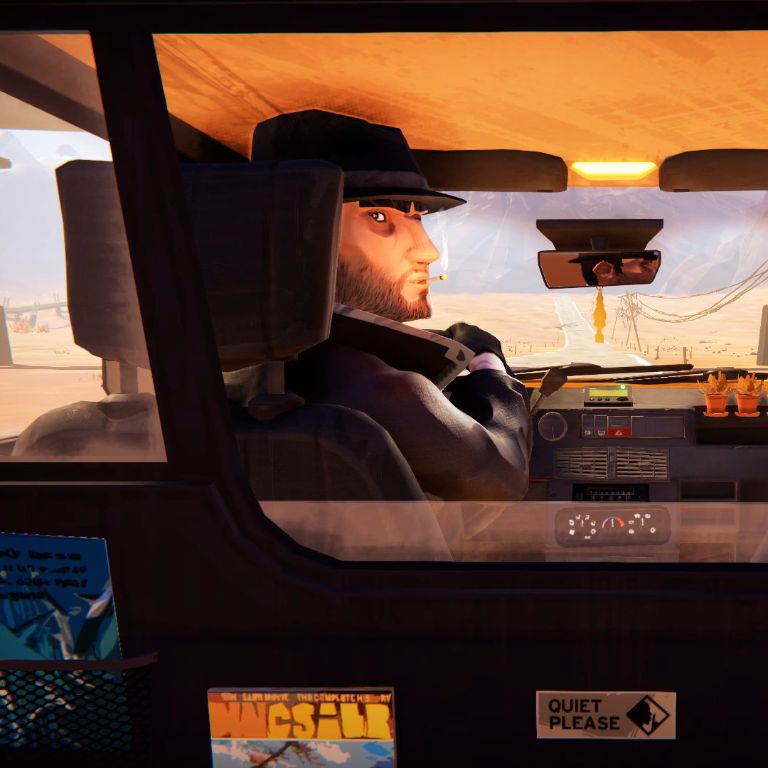

# Domain-specific content generation (Diffusion models)
## Персонализация диффузионных моделей
### Что такое персонализация?
Персонализация в контексте генеративных диффузионных моделей это задача дообучения этих моделей на специфическом домене. К примеру генерация лица специфического человека.
### Почему нужна персонализация?
Сложность в генерации специфического объекта или стиля - одна из основных проблем в генеративных моделях. Обычным текстовым запросом невозможно описать объект, которого не было в обучающей выборке диффузионной модели, а специфическую стилистику очень сложно сохранять между генерациями из-за стохастической природы диффузионного процесса.
### Как формулируется задача?
Задача персонализации (также употребляемая как fine-tuning) txt2img моделей заключается в их дообучении на специфическом домене (Объекты, стили, концепты). На данный момент основными (наиболее часто используемыми) способами fine-tuning'а диффузионных моделей являются три способа: Dreambooth, LoRA (и её последователи LoHA, LoKR, DyLoRA и т.д.) и Textual Inversion. В контексте этого проекта я сосредоточусь на Dreambooth и LoRA.
## Dreambooth как способ персонализации
### Идея Dreambooth.
Используя несколько (~3-5) изображений объекта, авторы статьи fine-tune'ят text2image диффузную модель для генерации объекта в различных сценах, позах и световых параметрах.
В процессе обучения, авторы тюнят low-resolution t2i модель на парах: изображение и текстовый промпт, в котором есть уникальный идентификатор и имя класса (к примеру, A owhxdax dog, где owhxdax - идентификатор, а dog - класс объекта). Параллельно к этому, они прикладывают prior preservation loss, который нужен для того чтобы избежать переобучения и language drift'а. Для них используются изображения того же класса, однако другого объекта (к примеру, если мы обучаем на изображении корги, то для регуляризации подойдут изображения лабрадора, пуделя и прочих пород собак). *Хотя практика показывает, что модель может обучаться и без регуляризационных изображений* \

### В чём новаторство подхода?
Изначальная цель авторов статьи была в решении проблем language drift'а и overfitting'а. \

 \
Решением этих проблем показало использование "autogenous class-specific prior-preserving loss", который, как описано выше, генерирует сэмплы класса объекта до обучения, а затем использует их в supervised подоходе, чтобы сохранить "знания" об объектах класса. Помимо этого, авторы обучат super resolution компонент сети парами: low resolution изображение и high resolution изображение. Это нужно для сохранения маленьких деталей обучаемого объекта. 
### Результаты подхода.
Авторы статьи сравнивают свой подход c Textual Inversion, подход которого заключается в тюнинге параметров не всей сети, а только небольшого текстового эмбеддинга. Результаты DreamBooth по метрикам DINO, CLIP-I и CLIP-T оказались более близки к входным изображениям. 

## LoRA Fine-tuning
### Разница LoRA и DreamBooth
Стоит отметить, что LoRA (Low Rank Adaption of Large Language Models) это ещё один подход к персонализации text2image моделей, который был заимствован из контекста больших языковых моделей. [[1]](#1). \
Основное отличие от подхода DreamBooth это обучение параметров не всей сети, а только небольших матриц, встроенных в сеть. \
  \
*Изображения взяты с [[2]](#2)* \
Основное преимущество такого подхода в том, что после обучения мы получаем не целую обученную сеть весом в ~5Gb, а только эмбеддинг размером ~150Mb. 
### Домен обучения
В качестве домена обучения, я решил обучить новый стиль, основанный на скриншотах из игры Road 96. Я собрал скриншоты из игры из разных форумов и сайтов и обрезал их до разрешения 768x768
 \
 \
 \
Всего я собрал 24 изображения, что скорее всего оказалось недостаточно для обучения стиля, но тем не менее результаты получились интересные. \
Датасет я выложил на https://huggingface.co/datasets/Outrun32/road96screenshots

### Примеры полученных изображений (non cherry picked. DreamShaper model!)
A photo of a car in style &lt;s1>&lt;s2> \
 \
A photo of a girl smiling in style &lt;s1>&lt;s2> \
 \
A photo of lake and mountains in style &lt;s1>&lt;s2> \
 \
A photo of a man with a beard in style &lt;s1>&lt;s2> \
 \
## References
<a id="1">[1]</a> Hu *et al.* LoRA: Low-Rank Adaptation of Large Language Models (2021) \
<a id="1">[2]</a> https://www.reddit.com/r/StableDiffusion/comments/10cgxrx/wellresearched_comparison_of_training_techniques/